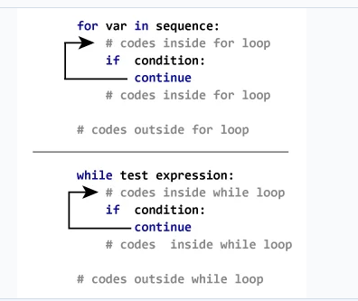
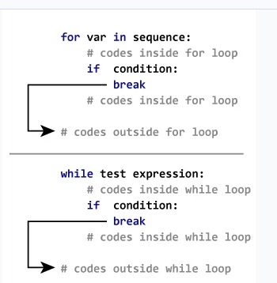

# continue and break:

[ref](https://www.programiz.com/python-programming/break-continue)

1. continue: skip the rest of the code inside a loop for the current iteration ***only***. 

2. break: Ot terminates the loop containing it.  

# While:

## while True:
    It means loop forever. Therefore, we need to set a `return/break` inside the loop to stop once some condition is satisfied. 